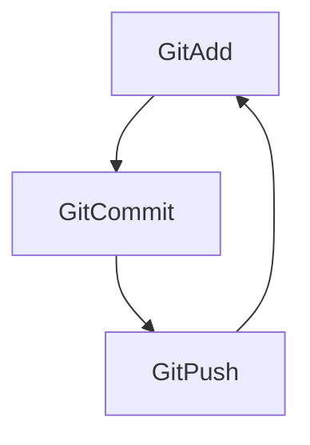

# Gaëtan
👋 I'm Gaëtan from France, living in Bordeaux 🍷, second year student at Epitech Digital School, I really enjoy learning languages. 

Actually:

- 🔭 I’m currently working on the C language
- 🔒 I’m currently learning Cybersecurity
- 📫 How to reach me: **gaetandubernat@orange.fr**

### Connect with me:

&nbsp;&nbsp;

### Languages and Tools:

 
 

### My daily routine :

### ⭐ GitHub Stats

